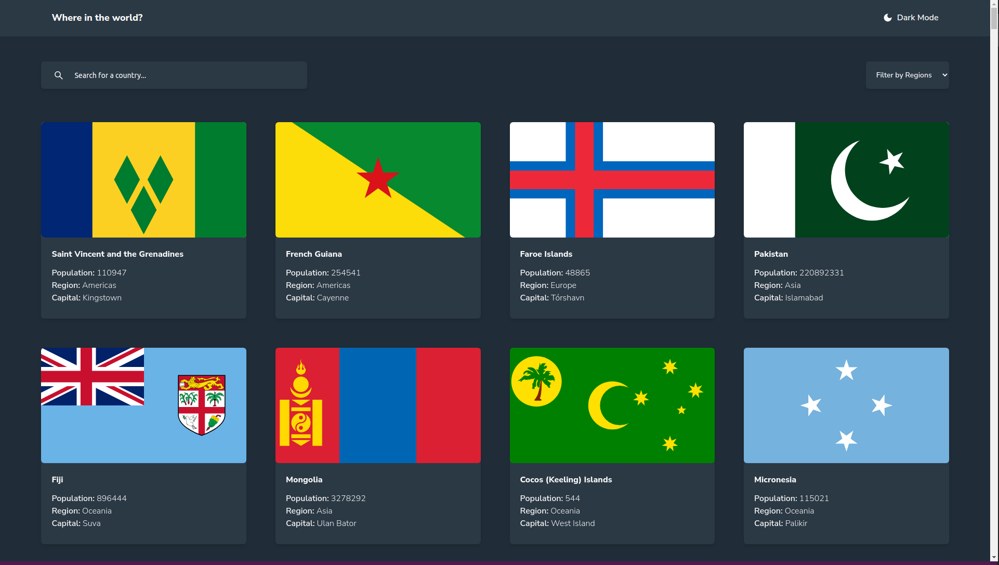
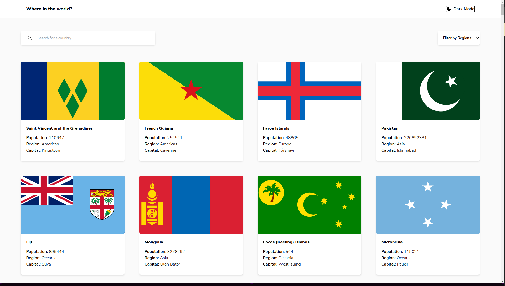

# Rest-Countries with theme switcher

This is an app built with ReactJs.

## Table of contents

- [Overview](#overview)
  - [The challenge](#the-challenge)
  - [Screenshot](#screenshot)
  - [Links](#links)
- [My process](#my-process)
  - [Built with](#built-with)
  - [Useful resources](#useful-resources)
- [To use](#usage)

## Overview

### The challenge

Users should be able to:

- View the optimal layout for the site depending on their device's screen size
- See all countries from the API on the homepage
- Search for a country using an `input` field
- Filter countries by region
- Click on a country to see more detailed information on a separate page
- Click through to the border countries on the detail page
- Toggle the color scheme between light and dark mode

### Screenshot

### Links

- Live Site: [Vercel App](https://rest-countries-bibatjed.vercel.app)

## My process

### Built with

- React
- Tailwind CSS
- Typescript
- React Query
- React Router

### Useful resources

- [REST Countries V2 API](https://restcountries.com/#api-endpoints-v2) - Rest Countries API documentation

## Usage

To use this app, you can clone this repo to your local machine, then npm install to install dependencies and npm run start to view live on your localhost.
